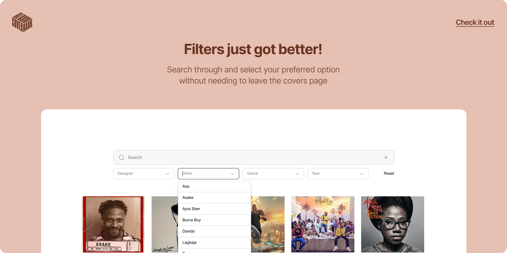
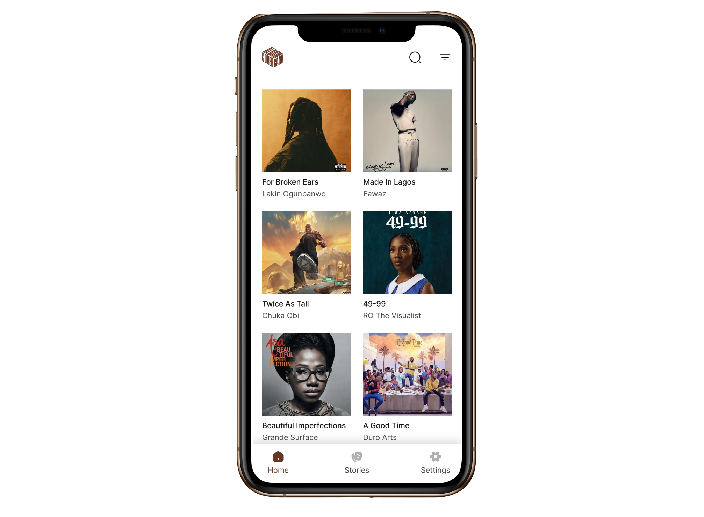

 
 

Cover Bank, a digital archive showcasing over 5,300 Nigerian album covers from 1980 to the present day, has launched a significant update to its platform, making it even easier for users to explore the vast history of Nigerian music and graphic design.

We’re excited to share a revamped filter experience that makes navigating the Cover Bank more intuitive. 
 
The latest update began with a simple question: *How do we improve the way users interact with the archive and enhance their experience?* 
 
 
With this update, users can quickly and efficiently access specific album covers and historical information, streamlining their journey through the archive.

This is just the start of our efforts to make the archive more interactive and user-friendly. Today’s announcement is the first step, and we’ve got even more exciting updates in store. 

But that’s not all—here’s a sneak peek at something else we’ve been working on, a project set to take things to a whole new level. We can't wait to share this with you.

 

Built by Helloworld, a technology studio for cultural production, and sponsored by Independent Arts, a studio dedicated to passion projects, Cover Bank provides a unique lens into the evolution of Nigerian music culture through album cover art.

Each cover in the archive represents the vision of Nigerian artists whose work capture the essence of Nigerian music, from Highlife and Afrobeat to Hip-hop and Afrobeats. These artists have shaped the cultural identity of their time through album artwork.

Browse the archive at <a href="https://albumcoverbank.com" target="_blank">albumcoverbank.com</a>
