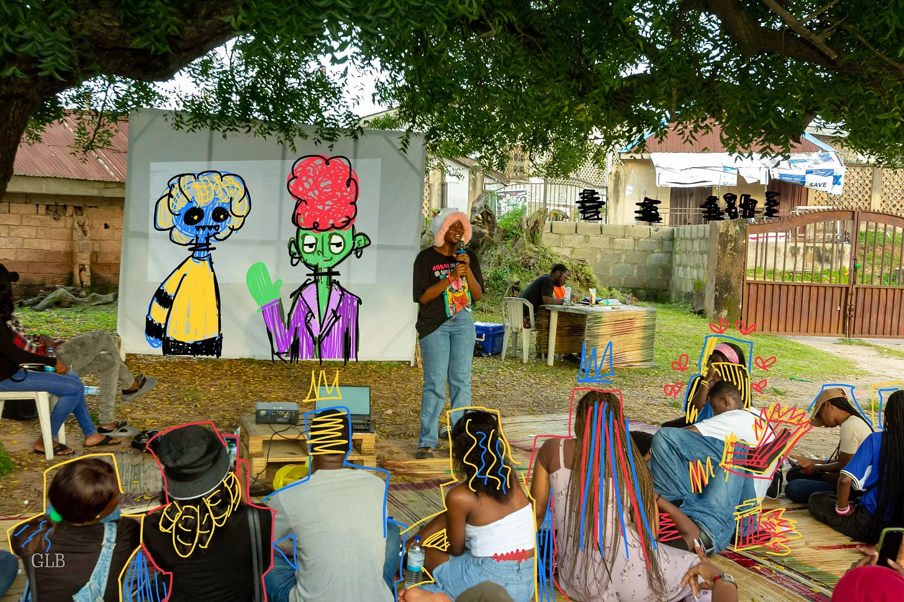
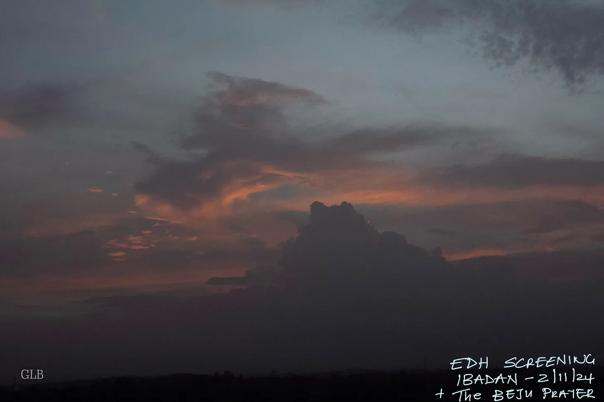
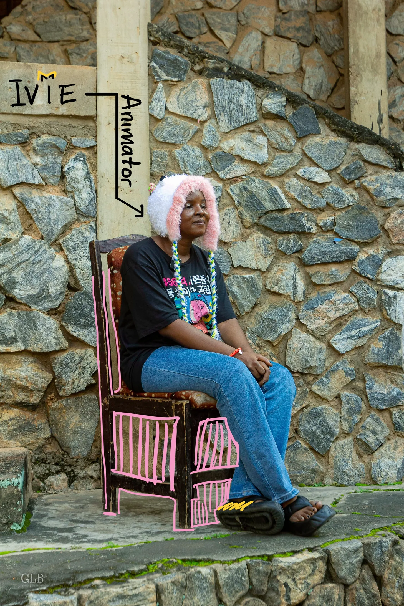
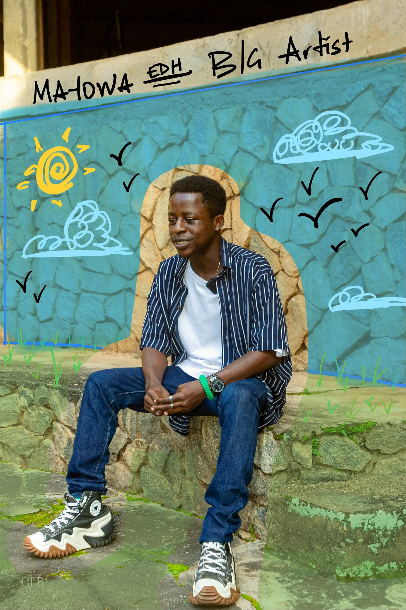
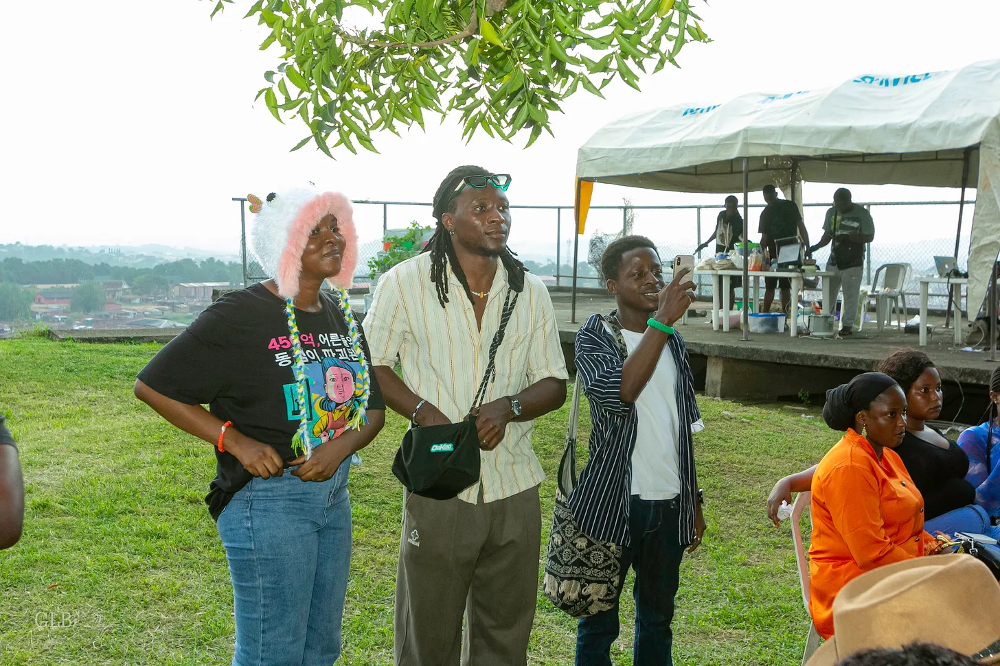
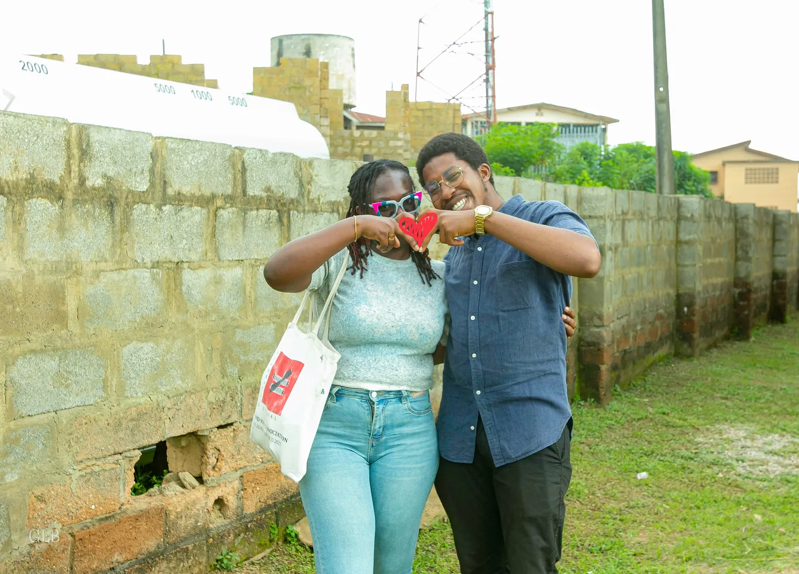
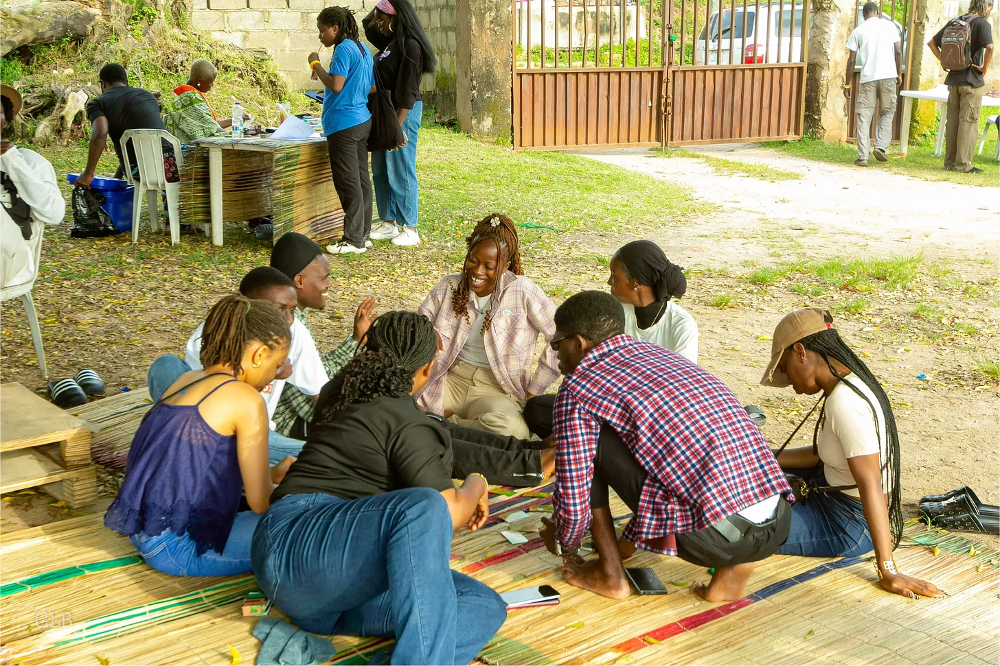
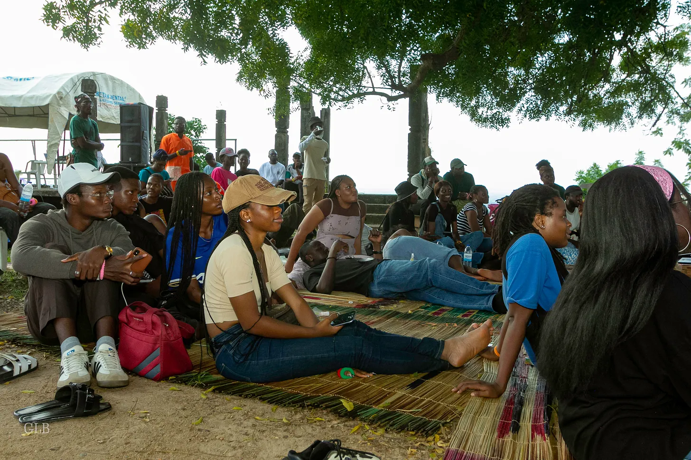
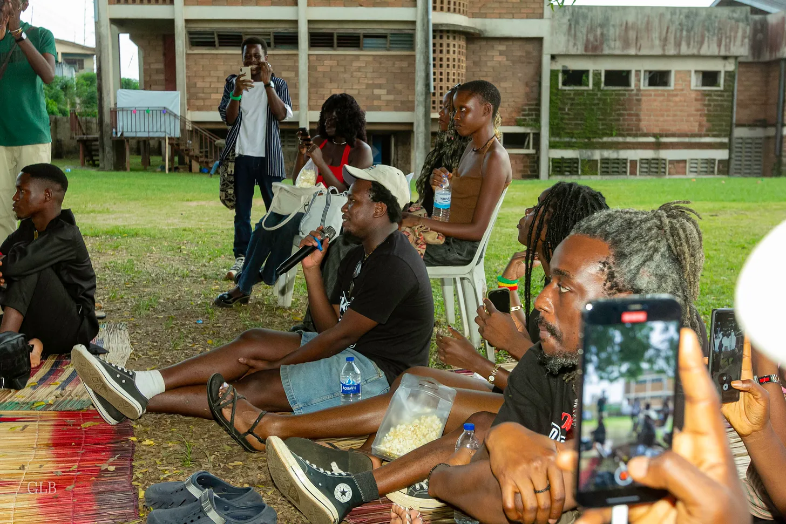
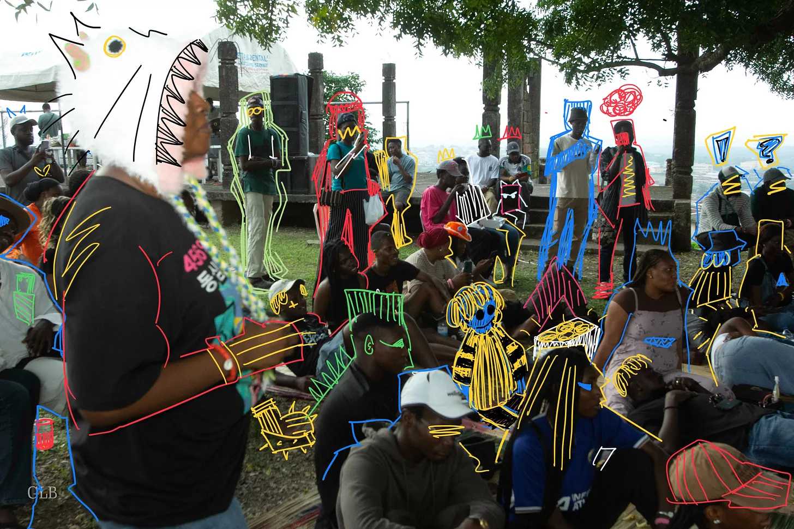

**Hola EDH Human,**

*Our recent screening at New Culture Studio in Ibadan was nothing short of wonderful.*
 

*Clouds from the EDH screening.*

A lot of people turned out to watch The Beju Prayer and meet our brilliant Ivie Lesso, animator behind the series.

*Ivie Lesso — Lead Animator of the EDH series*

From the one-on-one with fans to their reactions watching the series, it was an unforgettable experience that reminded us why EDH is better shared.

*EDH Animator, Fan and Background Artist.*

*EDH fans. 🫰*

*EDH is best enjoyed with friends.*

*Fans at The Beju Prayer Screening.*

*Q and A at the EDH screening.*

*Fans, if they existed in the EDH universe.*

## Everything you need to know about the EDH screening in Ibadan.
 

<iframe width="95%" height="350" src="https://www.youtube.com/embed/hG-y2zUiUcU" title="EDH Live in Ibadan: Screening Recap &amp; Highlights!" frameborder="0" allow="accelerometer; autoplay; clipboard-write; encrypted-media; gyroscope; picture-in-picture; web-share" referrerpolicy="strict-origin-when-cross-origin" allowfullscreen></iframe>

If you missed the screening, don’t worry, we have good news. *Episode 2 is coming out on the 1st of December.* Mark your calendars and  subscribe to our YouTube channel to be first in line for when The Beju Prayer drops.

Thanks for sticking around with us. 

EDH Team.